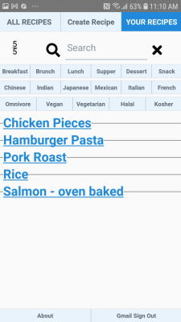
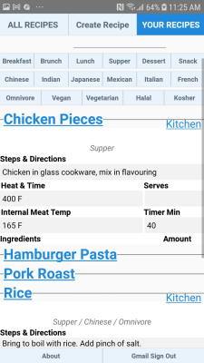
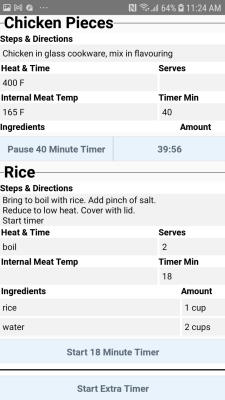

# Phone Recipes 

Cook multiple dishes at the same time with the help of stopwatches on this Android app.

-------------------------------
## App Use

### Step 1
Your recipes, after you have signed in with your Gmail account.



### Step 2
Choose 'Chicken Pieces' and 'Rice'. And then click 'Kitchen'.




### Step 3
Use the stopwatches to coordinate different dishes.




-------------------------------
## Run App on Android Emulator

### Install Node.js Packages

```bash
PS C:/the-project> yarn install
```


### USB Run:

  Bash 1

```bash
PS C:/the-project> yarn start
```

  Bash 2

```bash
PS C:/the-project> adb devices
                        List of devices attached
                        52109e7dea7f2495        device
                        emulator-5554   device

                 > adb -s emulator-5554 emu kill
                      OK: killing emulator, bye bye

                 > adb start-server

                 > adb devices
                        List of devices attached
                        52109e7dea7f2495        device

                 > yarn android

                 > adb -s 52109e7dea7f2495 reverse tcp:8081 tcp:8081

```

  http://localhost:8081/debugger-ui/

### EMLUATOR Run:

  unplug USB Android phone

  start emulator in Android Studio

  Bash 1

```bash
PS C:/the-project> yarn start
```
  Bash 2

```bash
PS C:/the-project> adb devices
List of devices attached
emulator-5554   device

PS C:/the-project> yarn android  --deviceId=52109e7dea7f2495

PS C:/the-project> adb -s emulator-5556 emu avd name
Pixel_4_XL_Edited_API_30_high-rez
OK


```

  Open in browser
    http://localhost:8081/debugger-ui/

-------------------------------
https://stackoverflow.com/questions/5350624/set-icon-for-android-application

### Release Build
```bash


PS C:/the-project/android> ./gradlew bundleRelease


PS C:/the-project/android> ./gradlew clean
PS C:/the-project/android> ./gradlew assembleRelease


```

FROM : https://stackoverflow.com/questions/49513047/react-native-assemblerelease-fails-for-task-appbundlereleasejsandassets

https://instamobile.io/android-development/generate-react-native-release-build-android/

Makes installable APKs that run without USB in [/android/app/build/outputs/apk/release/](/android/app/build/outputs/apk/release/)

The only permission used is Internet.
```XML
<uses-permission android:name="android.permission.INTERNET" />
```

-------------------------------

## Possible Errors and Fixes

ERROR
    EADDRINUSE: address already in use :::8081
  
    FIX
        npx kill-port 8081


ERROR
    java.util.concurrent.ExecutionException: com.android.builder.testing.api.DeviceException: com.android.ddmlib.InstallException: INSTALL_FAILED_CONFLICTING_PROVIDER: Scanning Failed.: Can't install because provider name com.facebook.app.FacebookContentProvider355198514515820 (in package com.STEENHANSEN.FONECOOK3) is already used by com.steenhansen.phonerecipes

    FIX
      adb uninstall com.STEENHANSEN.FONECOOK3


ERROR
    Requiring unknown module "8"
    Requiring unknown module "11"

    FIX
      /android/./gradlew clean

      /yarn start --reset-cache
      /yarn android

