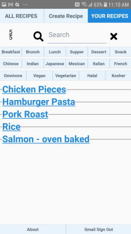
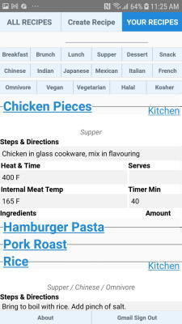
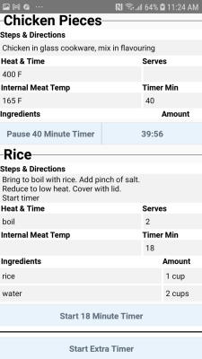

<a name="fast-start"></a>
# Phone Recipes 

## Cook multiple dishes at the same time with the help of stopwatches on this Android app.

Phone-Recipes on [Google Play](https://play.google.com/store/apps/details?id=com.fonecook3) with dark mode.

Phone-Recipes on [Web Page](https://phone-recipes.herokuapp.com) where editing of recipes available.


-------------------------------
## App Use


### Step 1
Your recipes, after you have signed in with your Gmail account.



### Step 2
Choose 'Chicken Pieces' and 'Rice'. And then click 'Kitchen'.




### Step 3
Use the stopwatches to coordinate different dishes.




-------------------------------
## Install Node.js Packages

```bash
PS C:/the-project> yarn install
```
-------------------------------
## Keystore Files

```bash
PS C:/the-project/keystore.REAL.properties
PS C:/the-project/android/app/debug.keystore
```

Need generating as shown in https://github.com/steenhansen/react-native-google-signin-verified.

-------------------------------

## USB Run:

  Bash 1

```bash
PS C:/the-project> yarn start
```

  Bash 2

```bash
PS C:/the-project> yarn android
```

  Debug Browser
```bash
http://localhost:8081/debugger-ui/
```


-------------------------------

### Release Build
```bash
Update versions in /the-project/android/app/build.gradle
        versionCode 2
        versionName "2.0"

PS C:/the-project/android> ./gradlew bundleRelease

Results in /the-project/android/app/build/outputs/bundle/release/app-release.aab
```


-------------------------------
### APK
```bash
PS C:/the-project/android> ./gradlew clean
PS C:/the-project/android> ./gradlew assembleRelease

Results in /the-project/android/app/build/outputs/apk/release/app-x86-release.apk
```

-------------------------------
### Multiple Devices Clashing

```bash
PS C:/the-project> adb devices
                        List of devices attached
                        52109e7dea7f2495        device
                        emulator-5554           device

PS C:/the-project> adb -s emulator-5554 emu kill
                        OK: killing emulator, bye bye

PS C:/the-project> adb start-server

PS C:/the-project> adb devices
                        List of devices attached
                        52109e7dea7f2495        device

PS C:/the-project> adb -s 52109e7dea7f2495 reverse tcp:8081 tcp:8081

```

-------------------------------

### Possible Errors and Fixes


ERROR
    EADDRINUSE: address already in use :::8081
  
    FIX
        npx kill-port 8081


ERROR
    java.util.concurrent.ExecutionException: com.android.builder.testing.api.DeviceException: com.android.ddmlib.InstallException: INSTALL_FAILED_CONFLICTING_PROVIDER: Scanning Failed.: Can't install because provider name com.facebook.app.FacebookContentProvider355198514515820 (in package com.STEENHANSEN.FONECOOK3) is already used by com.steenhansen.phonerecipes

    FIX
      adb uninstall com.fonecook3

ERROR
    jest-haste-map: Haste module naming collision: fonecook3

    FIX
      adb uninstall com.fonecook3


ERROR
    Requiring unknown module "8"
    Requiring unknown module "11"

    FIX
      /android/./gradlew clean

      /yarn start --reset-cache
      /yarn android
